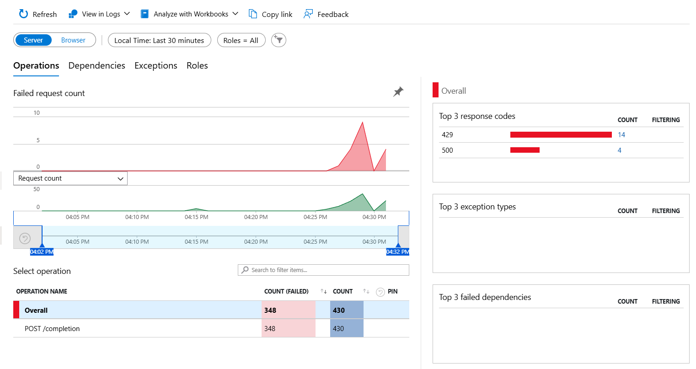
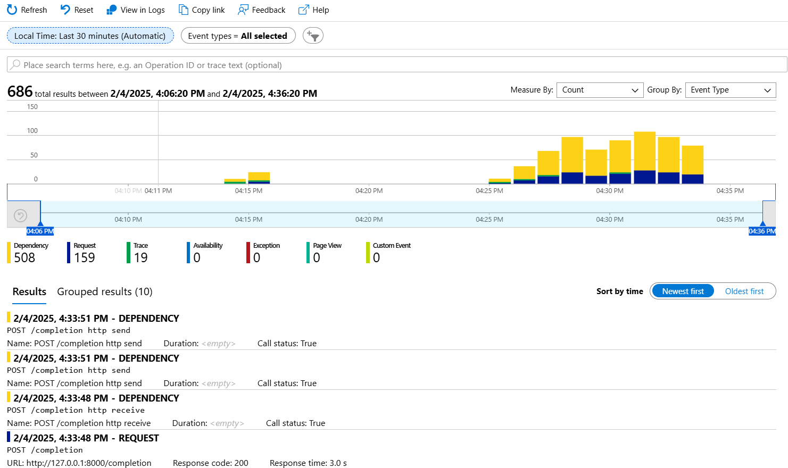

# apify-ai

This is a demo app that shows how to deploy a hugging face GenAI model as completion API instrumented with OpenTelemetry and Application Insights.

## Requirements

- Azure Application Insights connection string

## Setup and running the enviornment

- Create a Python environment: `python -m venv .venv`
- Activate the environment: `source venv\bin\activate`
- Install requirements: `pip install -r requirements.txt`
- Rename the service in Application Insights: `export OTEL_SERVICE_NAME="my-aiapi"`
- Create an `.env` file and add the following:
```bash
APPLICATIONINSIGHTS_CONNECTION_STRING="<CONNECTION_STRING>"
```
- Open vscode: `code .`
- Launch the debugger

>Note: The application will download the 4.5 gig Phi3.5 model and this will take sometime.

## Testing

- Navigate to: `http://localhost:8000/doc`
- Click the `POST /completion`
- Enter the following payload or something similar:
```json
{
  "messages": [
    {
      "role": "user",
      "content": "What is the speed of light?"
    }
  ],
  "temperature": 0.1,
  "max_new_tokens": 500
}
```
- Click the `Execute` button

> Note: The app comes with failures. It may generate 429 or 500 randomly. This is to be expected.

## Testing Background process

- The application execute a background process that self-calls the completion API. If you do not want to run this background process comment out the following lines:

```python
#background_thread = threading.Thread(target=task)
#background_thread.start()
```

## Viewing the telemetry

- Open the Azure Portal
- Navigate to the Application Insights account
- Explore the telemetry

### Failures



### Transactions

